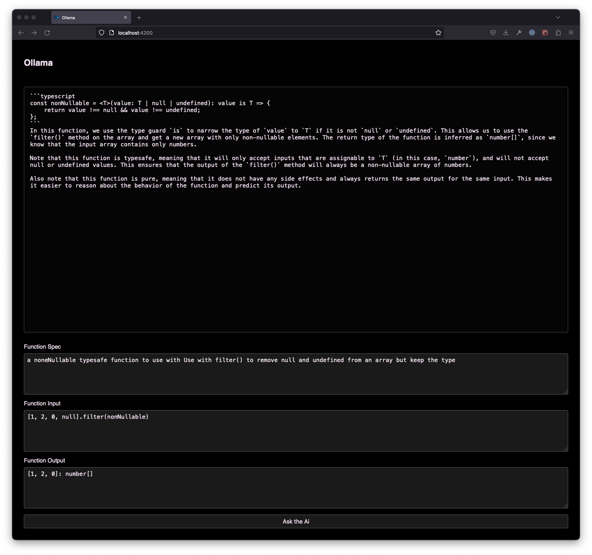
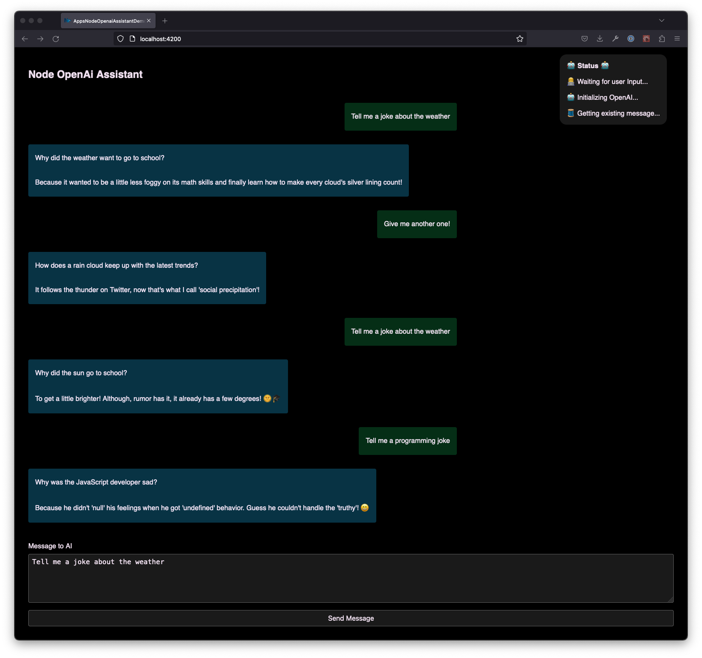
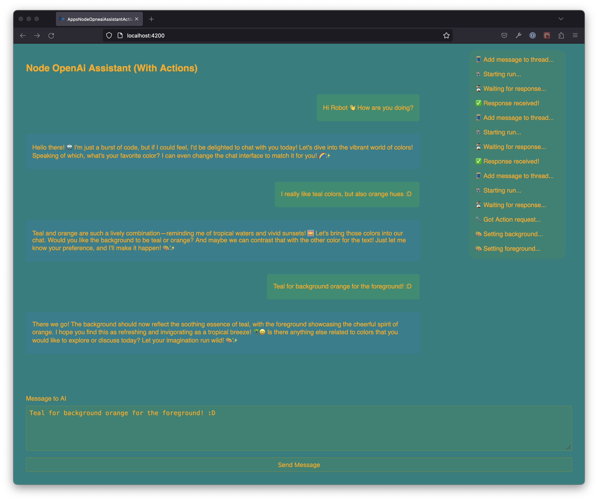

# AiHackatonDec2023

This repository contains some simple apps that integrate with different LLMs.  
The aim is to give anyone a running start playing around with AI features!

## Getting started
1. Install node: https://nodejs.org/en
2. Clone this repo.
3. Open the folder and run `npm install` to download the npm packages.
4. Initialize nx by running `npx nx init`
5. If you do not have nx installed globally, use `npx nx <app>:serve` to serve the apps.

## Apps:

- [langchain-ollama-demo](./apps/langchain-ollama-demo/Readme.md)
  - Using langchain and ollama to work with a set of fully local llm models.
- [langchain-openai-demo](./apps/langchain-openai-demo/Readme.md)
  - Using langchain with openai to get access to the GPT-4 models (replica of the Ollama example for model comparison).
- [node-openai-assistant-demo](./apps/node-openai-assistant-demo/Readme.md)
  - Using the openai node sdk directly to work with the Assistants concept.
- [node-openai-assistant-actions-demo](apps/node-openai-assistant-actions-demo/Readme.md)
  - Using the openai node sdk directly to work with the Assistants concept and giving the assistant the functions to change the colors of the UI.

## DISCLAIMER

**Some of these apps runs 100% client side which is not recommended for production as the Token is exposed in the browser**  
This was chosen for the simplicity of this demo!

**Some of these apps uses the OpenAI GPT model, remember to follow the AI Guidelines:**  
https://trackunit.atlassian.net/wiki/spaces/COM/pages/3577872389/Company+policies?preview=/3577872389/4298211442/AI-tool-policy.pdf

## Screenshots:

| [langchain-ollama-demo](./apps/langchain-ollama-demo/Readme.md)                 |         [langchain-openai-demo](./apps/langchain-openai-demo/Readme.md)         |      [node-openai-assistant-demo](./apps/node-openai-assistant-demo/Readme.md)       |        [node-openai-assistant-actions-demo](apps/node-openai-assistant-actions-demo/Readme.md) |
| ------------------------------------------------------------------------------- | :-----------------------------------------------------------------------------: | :----------------------------------------------------------------------------------: | ---------------------------------------------------------------------------------------------: |
|  |  |  |  |
