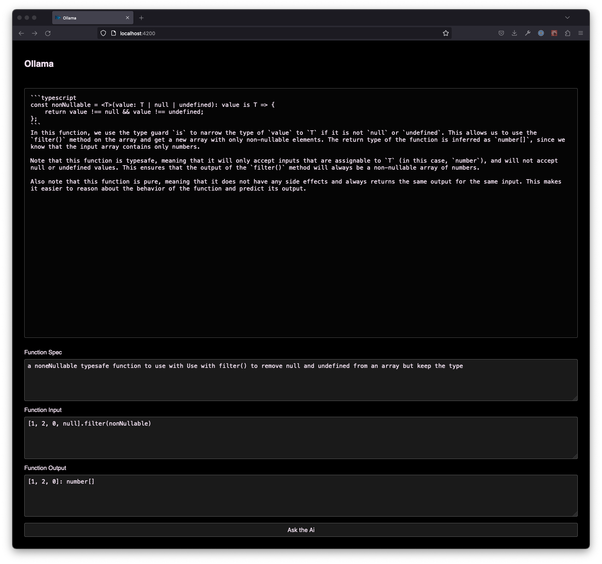

# Ollama example

A simple example of using langchain with local Ollama to generate a typescript function.

## Setup Ollama

Follow the setup guide on the Ollama repo: https://github.com/jmorganca/ollama.  
Before you use a model in the code, make sure to download that model by running `ollama run <modelname>` in a terminal window.

## How to run

Run `nx run langchain-ollama-demo:serve` to serve.

## How it looks:

