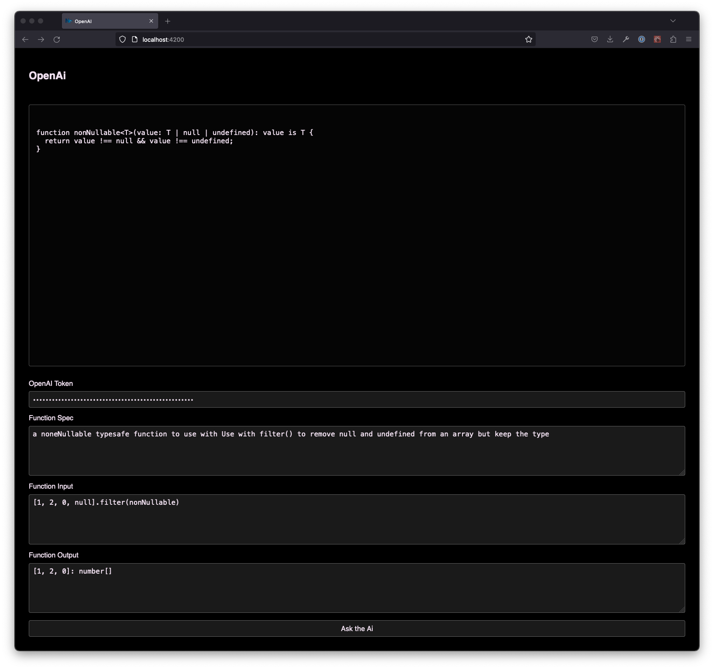

# OpenAI example

A simple example of using langchain with openai to generate a typescript function.

## DISCLAIMER

**This runs 100% client side which is not recommended for production as the Token is exposed in the browser**  
This was chosen for the simplicity of this demo!

**This is using the OpenAI GPT model, remember to follow the AI Guidelines:**  
https://trackunit.atlassian.net/wiki/spaces/COM/pages/3577872389/Company+policies?preview=/3577872389/4298211442/AI-tool-policy.pdf

## How to run

Run `nx run langchain-openai-demo:serve` to serve.

## How it looks:

